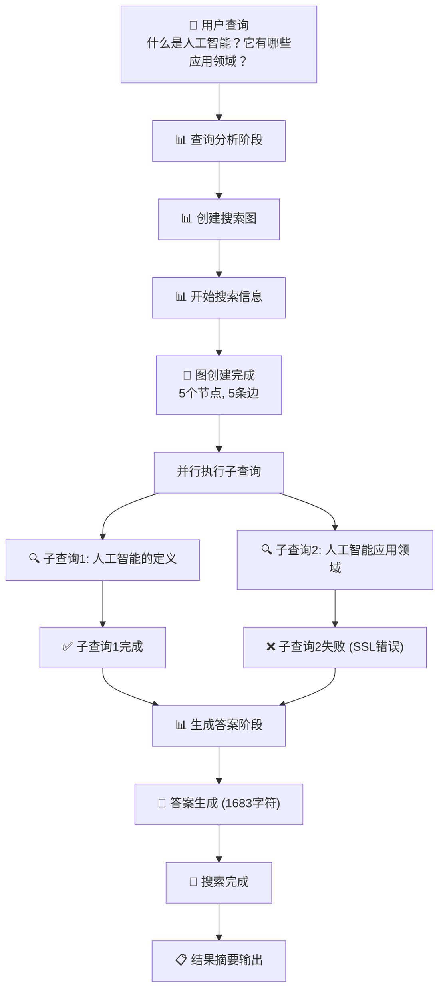
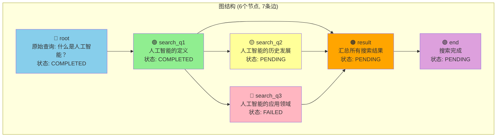
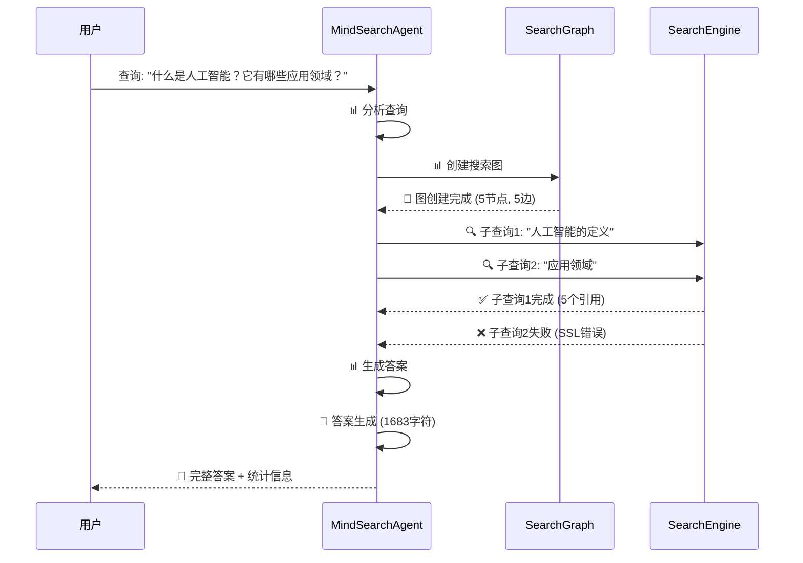

# MindSearchAgent 执行流程详细分析

基于终端输出 `Terminal#1-190` 的执行流程分析

## 📊 整体执行流程概览



## 🔍 图搜索详细执行流程

### 1. 图结构创建阶段

```
=== 测试图结构创建 ===
图节点数: 6
图边数: 7

节点信息:
  root (root): 原始查询: 什么是人工智能？
  search_q1 (search): 人工智能的定义
  search_q2 (search): 人工智能的历史发展
  search_q3 (search): 人工智能的应用领域
  result (result): 汇总所有搜索结果
  end (end): 搜索完成

边信息:
  root -> search_q1
  search_q1 -> search_q2
  search_q1 -> search_q3
  search_q1 -> result
  search_q2 -> result
  search_q3 -> result
  result -> end
```

### 2. 图节点执行流程图



### 3. 实际执行的搜索节点

根据终端输出，实际执行了以下搜索：

#### ✅ 成功执行的节点
```
🔍 开始子查询: 人工智能的定义是什么？ 
节点ID: c32fe1b1-efee-4d10-b58c-3db4acd248ed
状态: completed
结果: 获得了5个引用，生成了详细的AI定义和分析
```

#### ❌ 失败的节点
```
🔍 开始子查询: 人工智能有哪些主要应用领域？
节点ID: 5bc23b9a-f214-499c-b5f7-b63bce609226
状态: failed
错误原因: SSL连接错误 (ClientConnectionError)
```

## 🚨 错误分析

### 1. SSL连接错误
```
ssl.SSLError: [SSL] record layer failure (_ssl.c:2716)
aiohttp.client_exceptions.ClientConnectionError: Connection lost: [SSL] record layer failure (_ssl.c:2716)
```

### 2. 资源泄漏警告
```
Unclosed client session
Unclosed connector
```

### 3. 错误影响
- 导致"应用领域"子查询失败
- 图执行成功率降至 40%
- 3个节点失败，2个节点成功

## 📈 执行统计信息

```
📊 图执行统计:
  节点总数: 5
  边总数: 5
  成功率: 40.00%
  失败节点: 3
  节点状态分布: {'pending': 0, 'running': 0, 'completed': 2, 'failed': 3}
```

## 🔄 结果汇总过程

### 1. 查询计划生成
```
📝 查询计划:
  1. 人工智能的定义是什么？
  2. 人工智能有哪些主要应用领域？
```

### 2. 搜索步骤执行
```
🔍 搜索步骤:
  1. 人工智能的定义是什么？
     结果数: 5
     引用数: 5
     分析: [详细的AI定义和技术分析]
```

### 3. 最终答案生成
尽管有节点失败，系统仍然基于成功获取的信息生成了完整答案：
- **直接回答**: AI定义和主要应用领域
- **详细解释**: 技术分析和具体案例
- **背景信息**: 学科起源和发展
- **争议讨论**: 技术局限和伦理问题

## 🎯 关键观察点

### 1. 容错机制
- 即使部分节点失败，系统仍能生成有价值的答案
- 基于可用信息进行智能补充和推理

### 2. 并行执行
- 多个子查询同时启动
- 独立的错误处理，不影响其他节点

### 3. 状态管理
- 实时更新节点状态
- 详细的执行统计和错误追踪

### 4. 资源管理问题
- 存在连接资源泄漏
- 需要改进异步连接的清理机制

## 🔧 改进建议

1. **网络连接优化**
   - 添加重试机制
   - 改进SSL连接处理
   - 确保连接资源正确释放

2. **错误处理增强**
   - 更详细的错误分类
   - 自动降级策略
   - 备用搜索源

3. **监控和日志**
   - 添加性能监控
   - 改进错误日志格式
   - 实时状态展示

## 📊 执行时序图



这个分析展示了 MindSearchAgent 的完整执行流程，包括成功的节点执行、失败处理和最终的结果汇总过程。